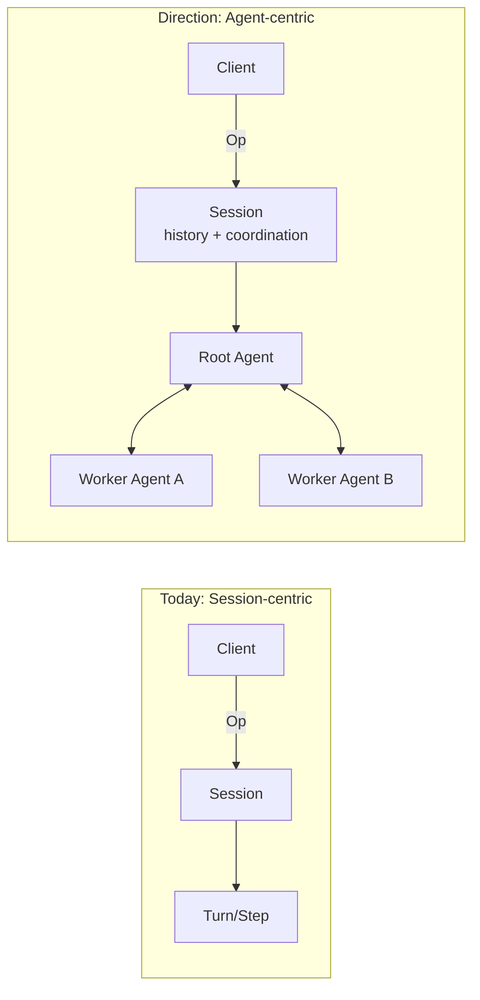

## Overview

Cante follows a clean separation of concerns with a client-daemon architecture. The UI and core logic are decoupled through message passing, making it possible to swap frontends (TUI, headless) without changing the underlying engine.


## Client-Daemon split

```
┌────────────────┐          ┌─────────────────────────────┐
│     Client      │    Op    │          Daemon              │
│                 │ ───────▶ │                              │
│  TUI / Headless │          │  Session ─▶ Turn ─▶ Step    │
│  or Serve       │ ◀─────── │                              │
│                 │    Evt   │  Tools    Providers   Store  │
└────────────────┘          └─────────────────────────────┘
```

- **Client** — The user-facing layer. The ratatui-based TUI, headless CLI runner, or an external process connected via `cante serve`. Sends `Op` operations and renders `Evt` events.
- **Daemon** — The core engine. Receives operations, manages sessions, dispatches to LLM providers, schedules tool execution, and emits events.
- **Transport** — A bounded operation channel and unbounded event channel (Tokio) for in-process clients (TUI, headless), JSONL over stdin/stdout for external clients (`cante serve --stdio`), a Unix domain socket for local clients that dial a shared host (`cante serve --sock`), or WebSocket for networked clients (`cante serve --ws`). Message IDs enable tracing across the boundary.

## Architecture direction: Session-centric to Agent-centric

Cante started with a session-centric runtime where `Session` is the primary execution owner. We are moving toward an agent-centric runtime, where long-lived `Agent` instances own execution and communicate through messages.



This is similar to an actor-based model:

- **Agent as actor** — Each agent has isolated state, a mailbox, and a single logical execution loop.
- **Message-driven coordination** — Agents coordinate via typed messages/events instead of shared mutable state.
- **Hierarchical supervision** — Parent agents can spawn child agents (sub-agents), monitor outcomes, and decide retry/escalation policy.

Why this shift:

- Better isolation between concurrent tasks and sub-agents
- Clear ownership of memory, permissions, and tool budgets per agent
- More predictable scaling as workflows become multi-agent

In this direction, `Session` remains important, but as a container for user interaction history, persistence, and protocol-level coordination rather than the only unit of execution.


## LLM providers

Cante is provider-agnostic. Each provider implements a common interface for sending prompts and receiving responses. Transient mid-stream failures reconnect within the turn. Streaming calls that produce no usable event and buffered calls that do not finish within five minutes fail with a timeout instead of hanging indefinitely. That window is per provider — override it with [`stream_idle_timeout_secs`](/reference/catalog-reference#provider-fields).

| Provider | Wire Format | Models |
|---|---|---|
| Anthropic | Messages API | Claude 4.5 and 5 families |
| Anthropic Subscription | Messages API | Claude family (OAuth) |
| OpenAI | Responses API | GPT-5 family |
| OpenAI Compatible | Chat Completions | Custom models |
| OpenAI Subscription | Responses API | GPT-5 family (OAuth via Codex) |
| Gemini | Gemini API | Gemini 3.x family |
| Vertex AI Gemini | Gemini API | Gemini 3.x family |
| Grok (xAI) | Responses API | Grok 4.6 |
| Zai | OpenAI-compatible | GLM-5.3 |
| Open Router | OpenAI-compatible | Multi-vendor chat models |
| Open Router Responses | Responses API | GPT models over OpenRouter |
| Open Router Anthropic | Messages API | Claude models over OpenRouter |
| DeepSeek | OpenAI-compatible | DeepSeek V4 family |
| Ali Coding Plan | Messages API | Qwen, Kimi, GLM, MiniMax via DashScope |
| Antix | Anthropic Messages | Claude, GPT, Gemini, Qwen, DeepSeek via Antigma |
| Antix (API key) | Anthropic Messages | Same Antix catalog with API-key auth |
| Local | OpenAI-compatible | GGUF models via llama.cpp |

Providers are resolved from a catalog at session init time. The user can override via CLI flags (`--provider`, `--model`) or persistent settings.

### Authentication

- **API keys** — Set via environment variables (`ANTHROPIC_API_KEY`, `OPENAI_API_KEY`, `GEMINI_API_KEY`, `XAI_API_KEY`, `OPENROUTER_API_KEY`, `OPENAI_COMPATIBLE_API_KEY`, `ZAI_API_KEY`, `DEEPSEEK_API_KEY`, `ALI_CODING_PLAN_API_KEY`, `VERTEX_GEMINI_API_KEY`, `ANTIX_API_KEY`)
- **OAuth** — Interactive OAuth flow supported for Anthropic, OpenAI, and Antix, handled through the TUI

## Tool system

Tools are the agent's hands. Each tool implements the `Tool` trait:

```rust
#[async_trait]
pub trait Tool: Send + Sync {
    fn metadata(&self) -> &ToolMetadata;
    async fn call(&self, input: ToolCallInput) -> Result<ToolCallOutput>;
}
```

### Built-in tools

| Tool | Category | Approval | Description |
|---|---|---|---|
| `Read` | File I/O | No | Read text, image, or PDF file contents |
| `Write` | File I/O | Yes | Create or overwrite files |
| `Edit` | File I/O | Yes | Exact string replacement in files |
| `Glob` | File I/O | No | Find files by pattern |
| `Grep` | File I/O | No | Search file contents with regex |
| `Bash` | Shell | Yes | Execute shell commands; returns a durable handle when a command outlives its `max_wait_ms` window |
| `Agent` | Builtin | No | Spawn sub-agent for complex tasks |
| `TodoWrite` | Builtin | No | Manage task lists |
| `WebFetch` | Builtin | Yes | Fetch and process web content |
| `WebSearch` | Builtin | Yes | Search the web (auto-enabled on web-search-capable providers) |
| `ViewImage` | Builtin | No | Read and analyze images (opt-in) |

### Tool filtering

Tools can be filtered at session level:

- **Base list** (`--tools`) — Replace the default set with exactly these tools
- **Include list** (`--include-tools`) — Add tools on top of the default or `--tools` base set
- **Exclude list** (`--exclude-tools`) — Remove tools after the base and include lists are applied
- Supports ToolMatcher syntax: `Bash(ls -la)`, `Agent(explore)`
- Names are matched case-insensitively
- The same selection gates dynamically registered tools (MCP servers), so they cannot bypass the filter

## Session lifecycle

1. Client sends `Op::StartSession` with model, provider, and policy
2. Daemon resolves the provider, authenticates, discovers skills and sub-agents
3. Daemon creates a `Session` and emits `Evt::SessionStart`
4. User sends `Op::UserInput` to start a task
5. Session spawns a `Turn` which communicates with the LLM
6. Turn executes tools, requests approvals, and eventually completes
7. When the context budget nears the limit, auto-compaction evicts aged tool results and summarizes only the older prefix while preserving the recent working state; manual compaction uses a tighter target
