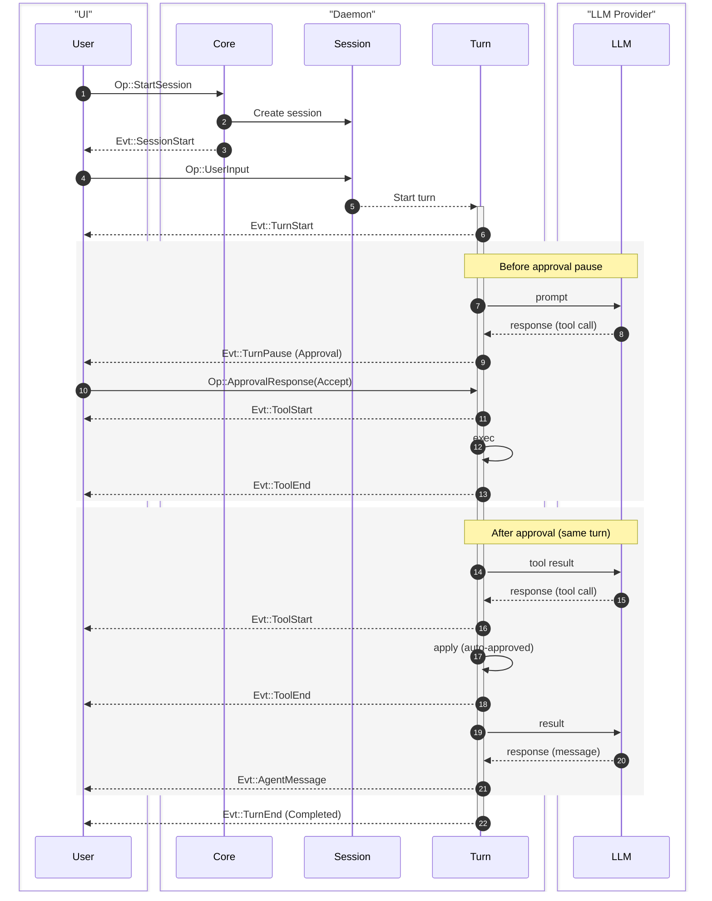
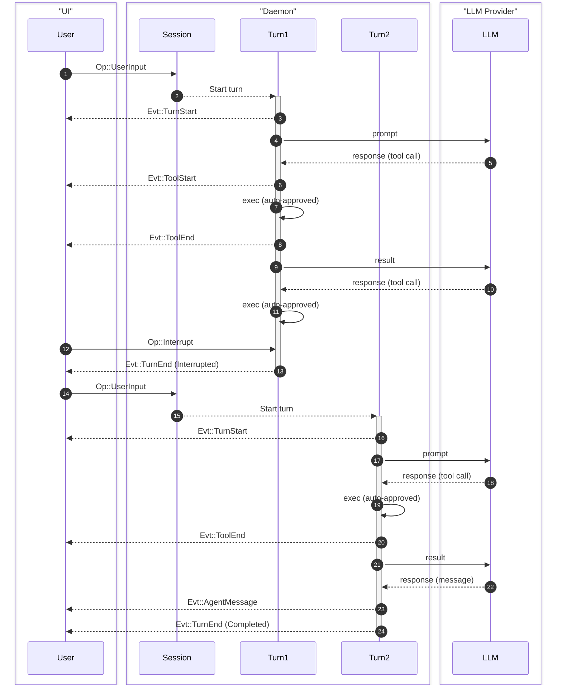

Cante models agent interactions as a hierarchy of concepts, connected by a typed message-passing protocol.

## Concept hierarchy

```
Project
 └── Session
      └── Task
           └── Turn
                └── Step
```

| Concept | Description |
|---|---|
| **Project** | A git repo or root directory. Can have multiple sessions. |
| **Session** | One episode of interaction between user and Cante. Manages dialog state, token usage, and context compaction. |
| **Task** | One piece of work the user wants to accomplish. Can span multiple turns. |
| **Turn** | One back-and-forth with the agent. Starts with user input, ends with agent message or approval request. |
| **Step** | One interaction from agent with LLM. Handles tool calls and other mechanics. |

:::note
Generally, if there is no approval interruption, one task consists of one turn.
:::

## Protocol: Ops and Events

Cante uses a message-passing protocol between the client (TUI or headless runner) and the daemon. Operations (`Op`) flow from client to daemon, and events (`Evt`) flow from daemon to client.

### Message IDs

Every message has a custom `Id` type with a 4-byte prefix for tracing:

- `op_` — operations
- `evt_` — events
- `ses_` — sessions
- `step_` — steps

## Operations reference

Operations (`Op`) are sent from the client to the daemon, wrapped in an `OpMsg` envelope with a unique `Id`.

| Op | Payload | Description |
|---|---|---|
| `StartSession` | `SessionRequest` | Initialize a new session; set fields are pinned and unset fields resolve from the host's current defaults |
| `UpdateSession` | `SessionUpdate` | Update the active session (e.g. switch models, or rename it) without restarting |
| `ResumeSession` | `session_id`, `unattended?` | Resume a previously persisted session; unattended clients deny calls that would otherwise pause for approval |
| `UserInput` | `String` | Submit a user prompt |
| `ShellInput` | `String` | Run a daemon-side shell command without starting an agent turn |
| `Steer` | `String` | Additional user guidance for the active turn |
| `ApprovalResponse` | `turn_id`, `responses: [ToolDecision]` | Respond to tool approval requests; a `Deny` may carry a `message` back to the model |
| `SlashCommand` | `name`, `args` | Invoke a skill by name |
| `RegisterLocalProvider` | `port`, `model?` | Register a running local inference server or router as the `local` provider |
| `RestoreLocalProvider` | — | Restore the previously registered local provider |
| `Compact` | `instructions?` | Compact older conversation history, optionally steering the handoff summary |
| `ContextReport` | — | Request a per-category context-window usage report |
| `Goal` | `GoalCommand` | Set, clear, or inspect the goal-driven execution loop |
| `AmbientPhrase` | `draft`, `req_id` | Request a best-effort spinner phrase for the current draft |
| `AmbientSuggestion` | `recent_user`, `recent_agent`, `req_id` | Request a best-effort next-prompt suggestion |
| `Interrupt` | — | Abort the current running operation |
| `Shutdown` | — | Graceful shutdown |

## Events reference

Events (`Evt`) are sent from the daemon to the client, wrapped in an `EventMsg` envelope with a timestamp, unique `Id`, and optional `parent` ID linking back to the originating operation.

| Evt | Payload | Description |
|---|---|---|
| `SessionStart` | `SessionInfo` | Session initialized with identity, mutable settings, optional title, skills, and subagents |
| `SessionUpdated` | `SessionInfo` | Session updated in place, repeating the session's equipped skills and subagents |
| `SessionEnd` | `session_id`, `reason`, `usage` | Session terminated with final usage accounting |
| `TurnStart` | `turn_id` | A new turn has begun |
| `TurnPause` | `turn_id`, `reason` | Turn paused (e.g. waiting for tool approval) |
| `TurnResume` | `turn_id` | A paused turn resumed after approval or steering |
| `TurnEnd` | `turn_id`, `status` | Turn completed, interrupted, or errored |
| `AgentMessage` | `String` | Complete text response from agent |
| `Thinking` | `String` | Complete chain-of-thought block |
| `MessageDelta` | `String` | Streaming message content chunk |
| `ThinkingDelta` | `String` | Streaming thinking content chunk |
| `ToolStart` | `ToolUse` | Tool execution began |
| `ToolUpdate` | `tool_use_id`, `seq`, `message` | Tool execution progress update |
| `ToolEnd` | `tool_use_id`, `tool_name`, `status`, `result_json` | Tool execution completed, was denied, was cancelled, or failed |
| `UsageUpdate` | `usage`, `context?` | Token usage statistics; sub-agent updates omit the private child context snapshot |
| `CompactStart` | — | Dialog compaction started |
| `CompactEnd` | `summary?` | Dialog compaction completed; the replacement summary is absent when none was produced |
| `ExtensionRefreshed` | `session_id`, `skills`, `subagents`, `mcp_servers` | Skills, subagents, and MCP server state refreshed |
| `UserInput` | `String` | Replayed only — appears in resumed sessions, not live turns |
| `Info` | `String` | Informational message |
| `Error` | `String` | Error message |
| `Goodbye` | — | Final message before disconnect |

:::note
For the full protocol reference with wire format examples and all type definitions, see the [Protocol Reference](/reference/protocol-reference) page.
:::

## Flow examples

### Basic UI flow

A single user input where one turn pauses for approval (`TurnPause`) and then resumes:



### Interruption flow

Interrupting a running turn and continuing with new input:



## Context management

Cante automatically manages context windows:

- **Token budget** — Each turn tracks token usage against the model's context limit
- **Auto-compaction** — When the dialog approaches the context limit, Cante evicts aged tool results first, preserves the newest slice and user messages verbatim, and summarizes only the older prefix the model will no longer see. Manual `/compact` uses a tighter target and usually folds more history. If a provider rejects a request below the advertised limit, the session learns a smaller effective window, rescales the compaction budget, and retries once. On by default; disable with the `auto_compact` [setting](/configuration/preference#settings-file) (manual `/compact` and overflow recovery remain available)
- **Tool result trimming** — Large outputs are bounded to fit within budget, and a parallel result batch shares one overall context cap. Older results decay before conversational messages are summarized; a cleared marker names the original `tool_use_id`, whose complete result remains in a saved session's event log

## Permissions

Cante has a permission system that gates tool execution. Rules are evaluated in first-match-wins order, with three possible decisions: **Allow**, **Ask**, or **Deny**. See the [Permissions](/configuration/permission) page for full details.
