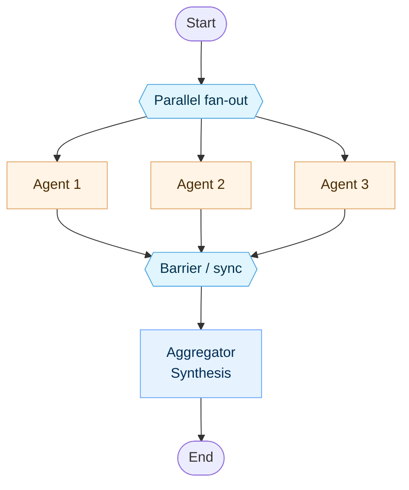
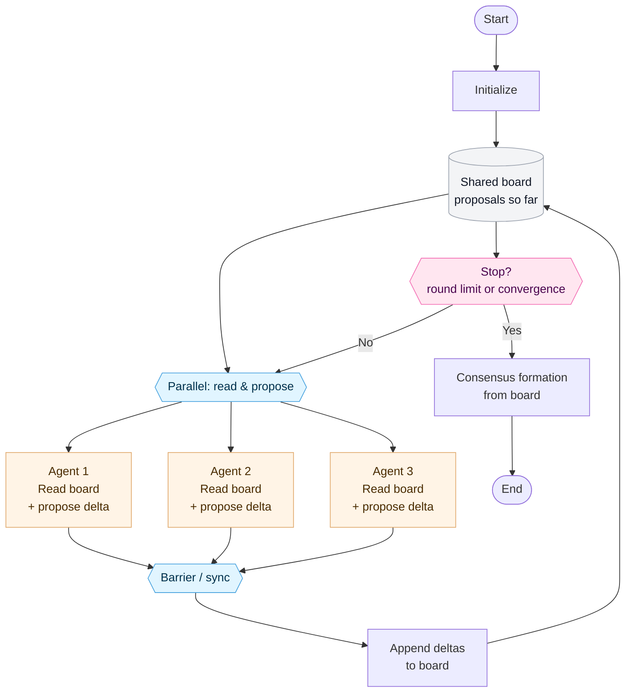
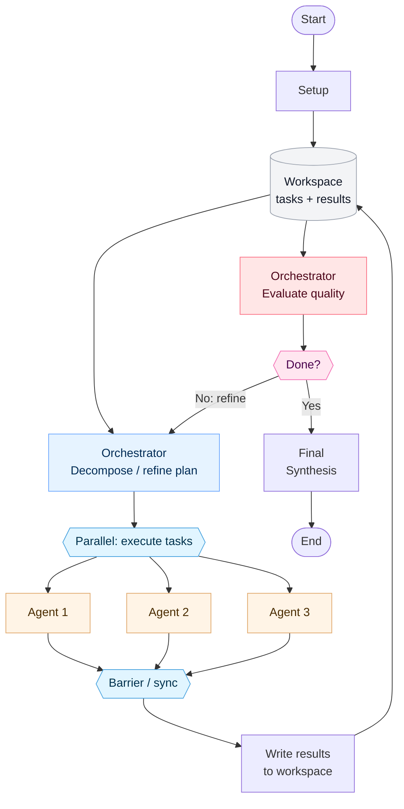
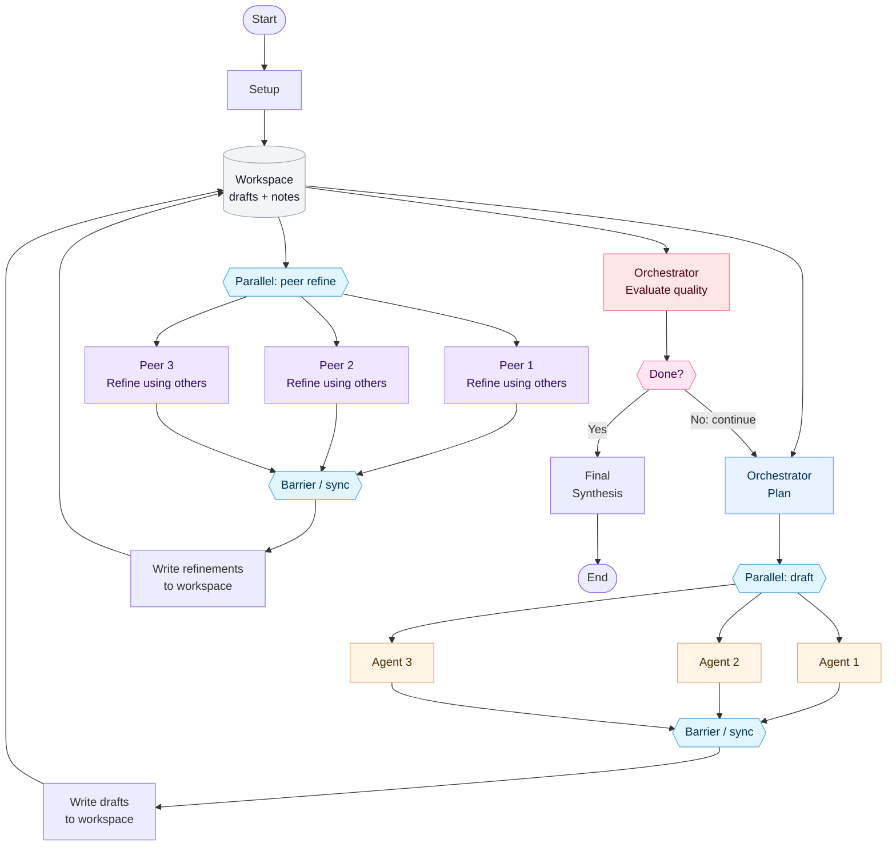

Cante 支持多种组织智能体协同工作的架构模式。每种架构模式都在自主性、协调开销与输出质量之间进行了不同的权衡取舍。

## 独立并行模式 {#independent}

智能体针对同一问题无交互地并行工作。最终由聚合器（Aggregator）统一汇总提炼结论。

**最适合：** 多元独立视角能够显著提升质量的任务（头脑风暴、多路冗余交叉验证）。

## 去中心化协同模式 {#decentralized}

智能体分轮次并行运行，读取其他智能体前序轮次的提案并提交改进意见。在固定轮次后，无需中心协调者即可自主形成共识。

**最适合：** 辩论式推理、同行评审（Peer Review）或不应由单一权威主导的方案协商。

## 中心化迭代模式 {#centralized-iterative}

由中心编排者（Orchestrator）拆解问题、并行派发智能体、评估执行结果，并决定继续微调还是完成输出。

**最适合：** 受益于自顶向下严密规划与质量关卡（Quality Gate）的复杂任务（带评审的代码生成、多阶段研究）。

## 混合迭代模式 {#hybrid-iterative}

将中心化编排与去中心化同行互评相结合。编排者负责规划并分派智能体，随后智能体在同行轮次中相互润色工作成果，最后由编排者进行质量评估。

**最适合：** 对产出质量要求极高的协作型任务（协作写作、架构设计）。

## 选择架构模式 {#choosing-an-architecture}

| 架构模式 | 协调机制 | 迭代方式 | 适用场景 |
|---|---|---|---|
| **独立并行** | 无 | 单轮直出 | 需要多角度独立见解且无交互开销 |
| **去中心化** | 点对点 Peer-to-peer | 固定轮次 | 智能体在无中心权威下自组织形成共识 |
| **中心化迭代** | 编排者驱动 | 质量关卡把关 | 具备评估检查点的结构化问题拆解与迭代 |
| **混合迭代** | 编排者 + 同行互评 | 质量关卡把关 | 兼顾自顶向下规划与自底向上精细同行评审 |
