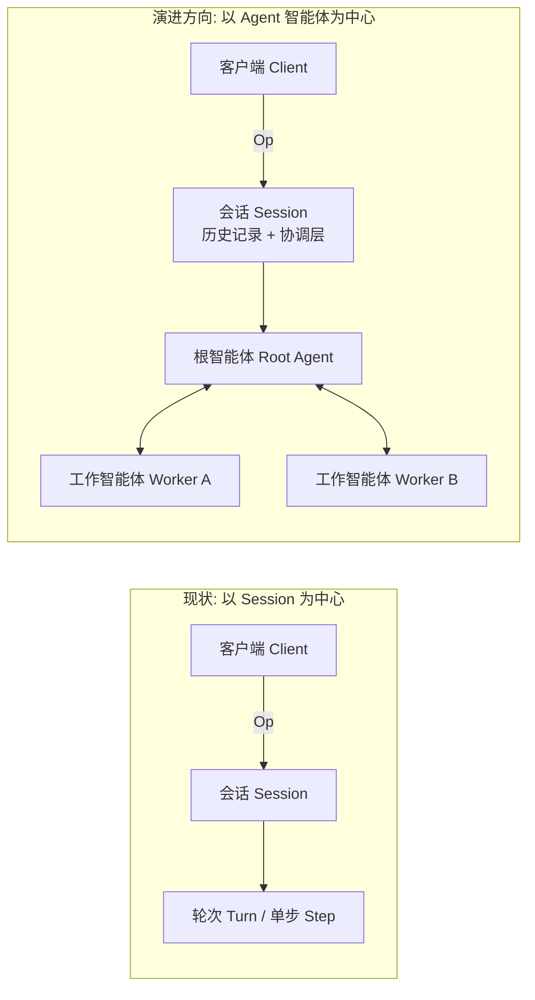

## 概览 {#overview}

Cante 采用清晰的职责分离设计，遵循客户端-守护进程（Client-Daemon）架构。展示层与核心执行引擎通过消息传递进行解耦，使得切换终端前端（TUI、无头 CLI）时无需变动底层核心引擎。


## 客户端与守护进程划分 {#client-daemon-split}

```
┌────────────────┐          ┌─────────────────────────────┐
│     Client     │    Op    │          Daemon             │
│                │ ───────▶ │                             │
│  TUI / Headless│          │  Session ─▶ Turn ─▶ Step    │
│  或 Serve 服务  │ ◀─────── │                             │
│                │    Evt   │  Tools    Providers   Store │
└────────────────┘          └─────────────────────────────┘
```

- **Client（客户端）** — 用户面向层。基于 ratatui 的 TUI 终端界面、无头 CLI 运行器，或通过 `cante serve` 连接的外部进程。负责发送 `Op` 操作指令并渲染接收到的 `Evt` 事件。
- **Daemon（守护进程）** — 核心引擎。接收操作指令、管理会话、分发大语言模型请求、调度工具安全执行并分发事件。
- **Transport（传输层）** — 进程内客户端（TUI、无头模式）使用 Tokio 有界操作通道与无界事件通道；外部客户端使用基于 stdin/stdout 的 JSONL 协议（`cante serve --stdio`）、供本地客户端连入共享宿主的 Unix 域套接字（`cante serve --sock`），或 WebSocket 网络协议（`cante serve --ws`）。通过消息 ID 实现跨进程边界的链路追踪。

## 架构演进：从以会话为中心到以智能体为中心 {#architecture-direction-session-centric-to-agent-centric}

Cante 最初采用以会话为中心的运行时，其中 `Session` 是核心执行单元。我们正迈向以智能体为中心（Agent-centric）的现代运行时：长寿命的 `Agent` 实例作为执行的所有者并通过消息通信。



该架构类似 Actor 模型：

- **Agent 即 Actor** — 每个智能体拥有独立隔离的状态、专属邮箱（Mailbox）及单一逻辑执行循环。
- **消息驱动的协同** — 智能体之间通过类型化消息/事件进行协同，而非共享可变状态。
- **分层监管** — 父智能体可以派生子智能体、监控执行结果并决定重试或上报策略。

为什么做出这一演进：

- 并发任务与子智能体之间获得更彻底的隔离
- 每个智能体拥有清晰明确的记忆、权限与工具预算所有权
- 在多智能体协同工作流中具备更可预测的横向扩展能力

在此方向下，`Session` 依然重要，但转变为承载用户交互历史、持久化快照以及协议级协调的容器，而非唯一的执行单元。

## 大语言模型提供商 {#llm-providers}

Cante 具备跨提供商无关性。每个提供商均实现了发送提示词与接收响应的通用接口。流式传输过程中的偶发网络闪断会在轮次内自动重连；流式调用若 5 分钟内没有可用事件、缓冲调用若 5 分钟内未完成，都会因超时报错而非无限挂起。该超时窗口支持按提供商配置 —— 可通过 [`stream_idle_timeout_secs`](/reference/catalog-reference#provider-fields) 覆盖。

| 提供商 | 通信协议格式 (Wire Format) | 支持模型 |
|---|---|---|
| Anthropic | Messages API | Claude 4.5 与 5 家族 |
| Anthropic Subscription | Messages API | Claude 家族（OAuth） |
| OpenAI | Responses API | GPT-5 家族 |
| OpenAI Compatible | Chat Completions | 自定义模型 |
| OpenAI Subscription | Responses API | GPT-5 家族（通过 Codex OAuth） |
| Gemini | Gemini API | Gemini 3.x 家族 |
| Vertex AI Gemini | Gemini API | Gemini 3.x 家族 |
| Grok (xAI) | Responses API | Grok 4.6 |
| Zai | OpenAI 兼容格式 | GLM-5.3 |
| Open Router | OpenAI 兼容格式 | 多厂商聊天模型 |
| Open Router Responses | Responses API | 通过 OpenRouter 调用的 GPT 模型 |
| Open Router Anthropic | Messages API | 通过 OpenRouter 调用的 Claude 模型 |
| DeepSeek | OpenAI 兼容格式 | DeepSeek V4 家族 |
| Ali Coding Plan | Messages API | 通过 DashScope 调用的 Qwen、Kimi、GLM、MiniMax |
| Antix | Anthropic Messages | 通过 Antigma 调用的 Claude、GPT、Gemini、Qwen、DeepSeek |
| Antix (API key) | Anthropic Messages | 相同 Antix 目录，通过 API Key 认证 |
| Local | OpenAI 兼容格式 | 通过 llama.cpp 运行的 GGUF 模型 |

提供商在会话初始化时从目录中解析。用户可以通过 CLI 参数（`--provider`、`--model`）或配置文件进行覆盖。

### 身份认证 {#authentication}

- **API 密钥** — 通过环境变量配置（`ANTHROPIC_API_KEY`、`OPENAI_API_KEY`、`GEMINI_API_KEY`、`XAI_API_KEY`、`OPENROUTER_API_KEY`、`OPENAI_COMPATIBLE_API_KEY`、`ZAI_API_KEY`、`DEEPSEEK_API_KEY`、`ALI_CODING_PLAN_API_KEY`、`VERTEX_GEMINI_API_KEY`、`ANTIX_API_KEY`）
- **OAuth** — Anthropic、OpenAI 与 Antix 支持交互式 OAuth 登录，在 TUI 中直接完成向导

## 工具系统 {#tool-system}

工具是智能体的双手。每个工具均实现 `Tool` trait：

```rust
#[async_trait]
pub trait Tool: Send + Sync {
    fn metadata(&self) -> &ToolMetadata;
    async fn call(&self, input: ToolCallInput) -> Result<ToolCallOutput>;
}
```

### 内置工具清单 {#built-in-tools}

| 工具 | 分类 | 默认需审批 | 说明 |
|---|---|---|---|
| `Read` | 文件 I/O | 否 | 读取文本、图片或 PDF 文件内容 |
| `Write` | 文件 I/O | 是 | 创建或覆盖文件 |
| `Edit` | 文件 I/O | 是 | 在文件中执行精确字符串替换 |
| `Glob` | 文件 I/O | 否 | 按模式查找文件列表 |
| `Grep` | 文件 I/O | 否 | 使用正则表达式搜索文件内容 |
| `Bash` | Shell | 是 | 执行 Shell 命令；当命令超出 `max_wait_ms` 窗口时返回持久句柄 |
| `Agent` | 内置核心 | 否 | 派生子智能体处理复杂任务 |
| `TodoWrite` | 内置核心 | 否 | 维护任务进度清单 |
| `WebFetch` | 内置核心 | 是 | 获取并处理网页内容 |
| `WebSearch` | 内置核心 | 是 | 检索互联网（在支持网络搜索的提供商上自动启用） |
| `ViewImage` | 内置核心 | 否 | 读取并分析图片（可选工具） |

### 工具过滤机制 {#tool-filtering}

工具可在会话级别进行过滤控制：

- **基础工具列表** (`--tools`) — 将默认工具集精确替换为指定列表
- **包含列表** (`--include-tools`) — 在默认或基础工具集之上额外引入工具
- **排除列表** (`--exclude-tools`) — 在基础与包含列表应用后剔除指定工具
- 支持 ToolMatcher 匹配器语法：`Bash(ls -la)`、`Agent(explore)`
- 工具名称匹配不区分大小写
- 动态注册的工具（MCP 服务器）同样受此约束，无法绕过过滤机制

## 会话生命周期 {#session-lifecycle}

1. 客户端发送 `Op::StartSession`（包含模型、提供商与策略配置）
2. 守护进程解析提供商、验证认证状态，并发现技能与子智能体
3. 守护进程创建 `Session` 并发出 `Evt::SessionStart`
4. 用户发送 `Op::UserInput` 提交任务提示词
5. 会话拉起 `Turn` 轮次与大语言模型通信
6. 轮次执行工具调用、请求用户审批并最终完成输出
7. 当上下文 Token 接近上限时，自动压缩机制对历史对话生成摘要
