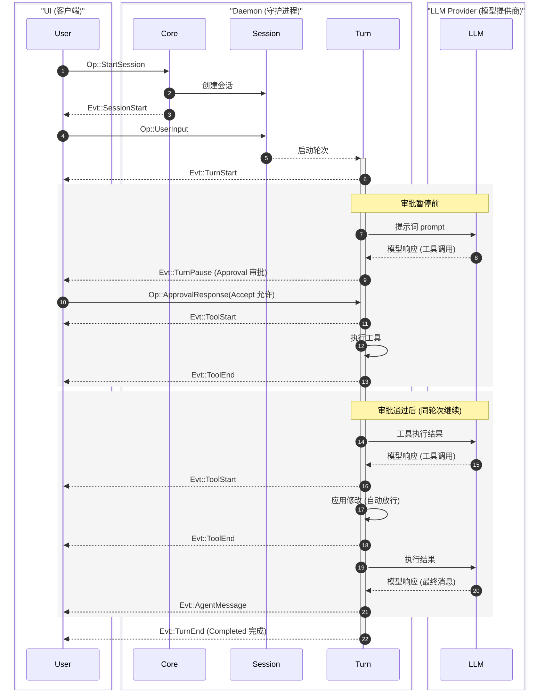
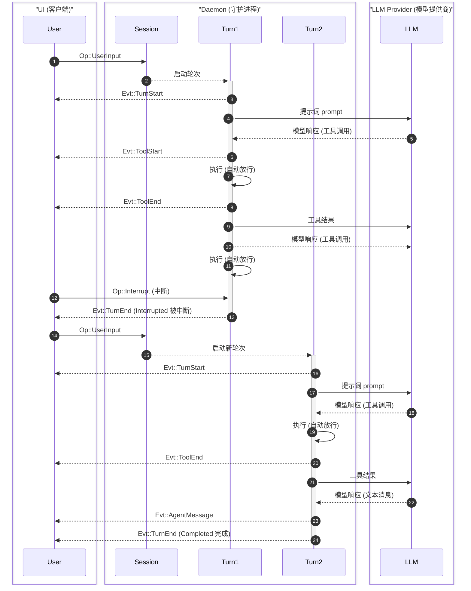

Cante 将智能体交互建模为层次化的概念体系，并通过强类型的消息传递协议进行连接驱动。

## 概念层级模型 {#concept-hierarchy}

```
Project (项目)
 └── Session (会话)
      └── Task (任务)
           └── Turn (轮次)
                └── Step (单步)
```

| 概念 | 说明 |
|---|---|
| **Project**（项目） | Git 仓库或根目录。可以拥有多个独立会话。 |
| **Session**（会话） | 用户与 Cante 之间的一次完整交互生命周期。负责管理对话状态、Token 消耗统计与上下文自动压缩。 |
| **Task**（任务） | 用户希望完成的一项具体工作。可以跨越多个 Turn 轮次。 |
| **Turn**（轮次） | 与智能体的一轮问答来回。以用户输入为起点，以智能体回复或工具审批请求为终点。 |
| **Step**（单步） | 智能体与大语言模型（LLM）的单次底层交互。负责处理工具调用（Tool Call）等中间逻辑。 |

:::note
通常情况下，若没有工具审批中断，一个 Task 任务通常包含一个 Turn 轮次。
:::

## 协议体系：操作指令与事件流 {#protocol-ops-and-events}

Cante 在客户端（TUI 或无头运行器）与守护进程 Daemon 之间采用消息传递协议。操作指令（`Op`）从客户端流向守护进程，事件流（`Evt`）从守护进程流向客户端。

### 消息 ID 规范 {#message-ids}

每条消息均包含带有 4 字节前缀的自定义 `Id` 类型，便于链路追踪：

- `op_` — 操作指令（Operations）
- `evt_` — 状态事件（Events）
- `ses_` — 会话（Sessions）
- `step_` — 模型单步交互（Steps）

## 操作指令参考 {#operations-reference}

操作指令（`Op`）由客户端发送给守护进程，封装在携带唯一 `Id` 的 `OpMsg` 消息封装中。

| 操作指令 (Op) | 载荷参数 (Payload) | 说明 |
|---|---|---|
| `StartSession` | `SessionRequest` | 初始化新会话；已设置字段会固定，未设置字段从主机当前默认值解析 |
| `UpdateSession` | `SessionUpdate` | 在不重启的情况下原地更新活跃会话（例如切换模型，或重命名会话） |
| `ResumeSession` | `session_id`, `unattended?` | 恢复此前持久化保存的历史会话；无人值守客户端会拒绝原本需要暂停等待审批的调用 |
| `UserInput` | `String` | 提交用户输入的提示词内容 |
| `ShellInput` | `String` | 在守护进程端运行 Shell 命令，不启动智能体轮次 |
| `Steer` | `String` | 向当前正在运行的轮次注入额外的用户引导指令 |
| `ApprovalResponse` | `turn_id`, `responses: [ToolDecision]` | 响应工具审批请求；`Deny` 拒绝时可携带返回给模型的 `message` 反馈 |
| `SlashCommand` | `name`, `args` | 按名称调用 Skill 技能 |
| `RegisterLocalProvider` | `port`, `model?` | 将运行中的本地推理服务器或路由器注册为 `local` 提供商 |
| `RestoreLocalProvider` | — | 恢复此前注册的本地提供商 |
| `Compact` | `instructions?` | 压缩较早的对话历史，可选指令可引导交接摘要 |
| `ContextReport` | — | 请求按类别拆分的上下文窗口占用报告 |
| `Goal` | `GoalCommand` | 设置、清除或查询目标导向型执行循环 |
| `AmbientPhrase` | `draft`, `req_id` | 为当前草稿请求尽力而为的加载状态语 |
| `AmbientSuggestion` | `recent_user`, `recent_agent`, `req_id` | 请求尽力而为的下一提示词建议 |
| `Interrupt` | — | 中断当前正在运行的操作 |
| `Shutdown` | — | 优雅关闭守护进程 |

## 状态事件参考 {#events-reference}

事件流（`Evt`）由守护进程推送到客户端，封装在携带时间戳、唯一 `Id` 以及可选的用于关联触发该事件的操作的 `parent` ID 的 `EventMsg` 消息封装中。

| 状态事件 (Evt) | 载荷参数 (Payload) | 说明 |
|---|---|---|
| `SessionStart` | `SessionInfo` | 会话初始化就绪，包含身份、可变设置、可选标题、技能与子智能体 |
| `SessionUpdated` | `SessionInfo` | 会话属性已原地更新，并重复会话已装备的技能与子智能体 |
| `SessionEnd` | `session_id`, `reason`, `usage` | 会话终止并提供最终用量统计 |
| `TurnStart` | `turn_id` | 新轮次已开始 |
| `TurnPause` | `turn_id`, `reason` | 轮次暂停（例如等待工具调用审批） |
| `TurnResume` | `turn_id` | 暂停的轮次在审批或引导后恢复 |
| `TurnEnd` | `turn_id`, `status` | 轮次执行完毕、被中断或发生错误 |
| `AgentMessage` | `String` | 智能体生成的完整文本回复 |
| `Thinking` | `String` | 完整的思考推理独白块 |
| `MessageDelta` | `String` | 增量流式文本消息片段 |
| `ThinkingDelta` | `String` | 增量流式思考内容片段 |
| `ToolStart` | `ToolUse` | 工具调用开始执行 |
| `ToolUpdate` | `tool_use_id`, `seq`, `message` | 工具执行进度更新 |
| `ToolEnd` | `tool_use_id`, `tool_name`, `status`, `result_json` | 工具执行完成、被拒绝、被取消或失败 |
| `UsageUpdate` | `usage`, `context?` | Token 消耗与统计数据更新；子智能体更新省略其私有上下文快照 |
| `CompactStart` | — | 对话历史压缩开始 |
| `CompactEnd` | `summary?` | 对话历史压缩完成；未生成替换摘要时为空 |
| `ExtensionRefreshed` | `session_id`, `skills`, `subagents`, `mcp_servers` | Skills、子智能体与 MCP 服务器状态已刷新 |
| `UserInput` | `String` | 仅用于会话回放 —— 出现在恢复的历史会话中，非实时轮次发出 |
| `Info` | `String` | 通用通知信息 |
| `Error` | `String` | 错误提示信息 |
| `Goodbye` | — | 断开连接前的最终消息 |

:::note
关于包含报文格式示例与所有类型定义的完整协议参考，请参阅[通信协议参考手册](/reference/protocol-reference)。
:::

## 交互时序流程示例 {#flow-examples}

### 基础交互流程 {#basic-ui-flow}

单次用户输入场景下，轮次暂停等待审批（`TurnPause`）并随后恢复执行的时序：



### 中断处理流程 {#interruption-flow}

中断正在运行的轮次并以新输入继续执行：



## 上下文管理 {#context-management}

Cante 自动管理上下文窗口：

- **Token 预算控制** — 每个轮次均依据模型的上下文上限精确追踪 Token 占用
- **自动压缩** — 当对话接近上下文上限时，Cante 会先清除较早的工具结果，原样保留最新片段与用户消息，只总结模型将不再看到的较早前缀。手动 `/compact` 使用更紧的目标，通常折叠更多历史。如果提供商在声明上限以下拒绝请求，会话会学习更小的有效窗口、重新缩放压缩预算并重试一次。默认开启；可通过 `auto_compact` [配置项](/configuration/preference#settings-file)关闭（手动 `/compact` 与溢出恢复依然可用）
- **工具输出裁剪** — 超大输出会被限制在上下文预算内，并行结果批次共享一个总上限。较早结果会先于对话消息衰减；清除标记会列出原始 `tool_use_id`，完整结果仍保留在已保存会话的事件日志中

## 权限控制 {#permissions}

Cante 内置权限管控系统控制工具执行。规则按首个命中即生效的顺序评估，支持三种判定：**Allow**（允许）、**Ask**（询问）与 **Deny**（拒绝）。完整细节请参阅[权限控制](/configuration/permission)。
